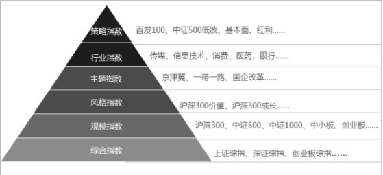
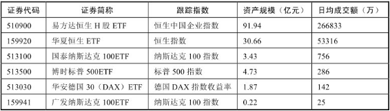

# 指数体系

股票价格指数就是选取有代表性的一组股票编制计算，用以描述股票市场总体价格水平或某类股票价格水平变化的指标。简单来说，股票指数就是一个股票组合，按照事先约定的计算方法，每天告诉你这个组合的变化情况。除股票价格指数以外，还有债券指数、商品价格指数等描述各种资产的指数。

## 指数的定义

《路透金融词典》对指数的定义为：各种数值的综合，用于衡量市场或经济的变化。指数被广泛地应用于经济、金融领域，如居民消费价格指数（CPI）、生产价格指数（PPI）等。而广大投资者耳熟能详的上证综指、沪深300等股票价格指数是指数在股票市场的应用。

## 指数的作用

证券市场的指数主要有三个作用

第一，刻画市场走势。市场的标尺，反映市场的平均收益和波动状况。大家最为熟悉的指数莫过于上证综指、深证成指和创业板指数，原因很简单，每天财经新闻都会滚动播放它们，通过指数，大家就能清楚地了解当天股票市场整体是涨还是跌。

第二，跟踪投资的工具。最常见的就是指数基金产品，大家耳熟能详的沪深300指数基金就是围绕沪深300指数产生的投资工具，通过基金管理公司运用程序化交易，替你按照指数权重购买300只沪深300指数里面的股票，最终达到指数涨幅多少，你的基金也能实现基本一致的收益水平。

第三，金融衍生品的工具。围绕指数衍生出股指期货、股指期权、场外衍生品等风险管理工具，如大家常听的比如上证50股指期货合约、沪深300股指期货合约和中证500股指期货合约。

## 指数分类

### 指数选样标准

指数最简单的分类就是**宽基指数和窄基指数**两大类。代表整个市场走势的，都属于宽基指数；窄基指数，一般多是行业指数或者主题指数。

还有一种分类方法，将指数主要分为综合指数、规模指数、行业指数、风格指数、主题指数、策略指数6大类。

**综合指数**：是总指数的综合形式，反映总体的综合变动情况，用于比较总量指标。常见的如上证综指、深证综指、创业板综指等，分别反映上海股票市场、深圳股票市场、创业板股票市场所有股票的走势情况。

**规模指数**：从市值规模角度选择不同成份股数量，更好表征不同板块大中小市值股票的走势情况。例如沪深300、中证500和中证1000三只指数，分别表征A股市场大盘、中盘以及小盘市值股票的走势情况。

**风格指数**：根据股票的风格特征，通常分为成长和价值两种风格。常见的如沪深300价值指数和沪深300成长指数。随着股票数量的增加，成长和价值划分已难以满足投资者的要求，于是出现了在成长型和价值型股票中进行的二级风格分类。这种进一步划分风格的办法，也称“风格的萃取”。规模是最常见的二级风格划分，于是出现了大盘成长、大盘价值、小盘成长、小盘价值等分类。

**行业指数**主要按照上市公司的主营业务收入进行分类，参照国际标准和行业指数的可投资性将营业业务属于一个行业的划分成一类。例如中证全指一级行业（十个一级行业），包含中证全指信息技术、主要消费、金融地产、可选消费、医药卫生、工业、能源、原材料、电信等十个行业。

**主题指数**是动态跟踪经济驱动因素的投资方式，通过发现经济体的长期发展趋势以及使这种发展趋势产生和持续的驱动因素，将能够受惠的相关产业和上市公司纳入投资范围。常见的主题指数如环保指数、养老指数、国企改革指数、一带一路主题指数、京津冀协调发展主题指数等。

**策略指数**是除传统的只做多的市值加权指数之外的指数。从定义表述可以看出，策略指数与其他指数的本质区别在于两点：一是加权方式，策略指数主要采用非市值加权方式，如基本面加权、财富加权、固定权重等；二是多空交易，策略指数可以采用多空两种交易方式，其他指数只能做单边操作。常见的策略指数如大数据指数、基本面指数、中证500低波指数等。

###  指数资产类别

从指数的资产类别来区分，主要可以分为股票指数、商品指数、债券指数、海外股票指数等

**股票指数**主要反映在证券交易所上市的股票组合的走势情况，股票ETF兼具基金及股票的优点，为投资者提供一个便捷及费率低廉的投资渠道。

目前，国内规模超过2亿元且最近1个月日均成交额超过1000万的ETF共计达到30只，除涵盖了上证50、沪深300、深证100、中小板、中证500、创业板等宽基ETF外，还包括了环保ETF、传媒ETF、医药ETF、银行ETF、证券ETF等主题行业ETF，可投资的ETF品种也日益丰富

**债券指数**反映的是债券市场价格总体走势。和股票指数一样，债券指数是一个比值，其涨跌反映了对应债券组合的涨跌情况。

**商品指数**反映同质化、可交易的商品的价格走势，如黄金、白银、原油等商品。

**海外股票指数**主要是跟踪海外股票市场的指数。

### 指数公司

指数公司是指数的重要编制机构，目前国内的指数公司主要分两类，一类是官方性质的指数公司——**中证指数有限公司和深圳证券信息公司**，市场上绝大部分基金产品都用这两家公司的指数。另一类是第三方编制机构，如申万证券和中信证券等证券公司。