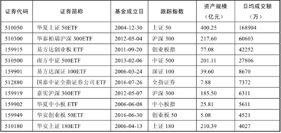

# 指数体系

股票价格指数就是选取有代表性的一组股票编制计算，用以描述股票市场总体价格水平或某类股票价格水平变化的指标。简单来说，股票指数就是一个股票组合，按照事先约定的计算方法，每天告诉你这个组合的变化情况。除股票价格指数以外，还有债券指数、商品价格指数等描述各种资产的指数。

## 指数的定义

《路透金融词典》对指数的定义为：各种数值的综合，用于衡量市场或经济的变化。指数被广泛地应用于经济、金融领域，如居民消费价格指数（CPI）、生产价格指数（PPI）等。而广大投资者耳熟能详的上证综指、沪深300等股票价格指数是指数在股票市场的应用。

## 指数的作用

证券市场的指数主要有三个作用

第一，刻画市场走势。市场的标尺，反映市场的平均收益和波动状况。大家最为熟悉的指数莫过于上证综指、深证成指和创业板指数，原因很简单，每天财经新闻都会滚动播放它们，通过指数，大家就能清楚地了解当天股票市场整体是涨还是跌。

第二，跟踪投资的工具。最常见的就是指数基金产品，大家耳熟能详的沪深300指数基金就是围绕沪深300指数产生的投资工具，通过基金管理公司运用程序化交易，替你按照指数权重购买300只沪深300指数里面的股票，最终达到指数涨幅多少，你的基金也能实现基本一致的收益水平。

第三，金融衍生品的工具。围绕指数衍生出股指期货、股指期权、场外衍生品等风险管理工具，如大家常听的比如上证50股指期货合约、沪深300股指期货合约和中证500股指期货合约。

## 指数分类

### 指数选样标准

指数最简单的分类就是**宽基指数和窄基指数**两大类。代表整个市场走势的，都属于宽基指数；窄基指数，一般多是行业指数或者主题指数。

还有一种分类方法，将指数主要分为综合指数、规模指数、行业指数、风格指数、主题指数、策略指数6大类。

**综合指数**：是总指数的综合形式，反映总体的综合变动情况，用于比较总量指标。常见的如上证综指、深证综指、创业板综指等，分别反映上海股票市场、深圳股票市场、创业板股票市场所有股票的走势情况。

**规模指数**：从市值规模角度选择不同成份股数量，更好表征不同板块大中小市值股票的走势情况。例如沪深300、中证500和中证1000三只指数，分别表征A股市场大盘、中盘以及小盘市值股票的走势情况。

**风格指数**：根据股票的风格特征，通常分为成长和价值两种风格。常见的如沪深300价值指数和沪深300成长指数。随着股票数量的增加，成长和价值划分已难以满足投资者的要求，于是出现了在成长型和价值型股票中进行的二级风格分类。这种进一步划分风格的办法，也称“风格的萃取”。规模是最常见的二级风格划分，于是出现了大盘成长、大盘价值、小盘成长、小盘价值等分类。

**行业指数**主要按照上市公司的主营业务收入进行分类，参照国际标准和行业指数的可投资性将营业业务属于一个行业的划分成一类。例如中证全指一级行业（十个一级行业），包含中证全指信息技术、主要消费、金融地产、可选消费、医药卫生、工业、能源、原材料、电信等十个行业。

**主题指数**是动态跟踪经济驱动因素的投资方式，通过发现经济体的长期发展趋势以及使这种发展趋势产生和持续的驱动因素，将能够受惠的相关产业和上市公司纳入投资范围。常见的主题指数如环保指数、养老指数、国企改革指数、一带一路主题指数、京津冀协调发展主题指数等。

**策略指数**是除传统的只做多的市值加权指数之外的指数。从定义表述可以看出，策略指数与其他指数的本质区别在于两点：一是加权方式，策略指数主要采用非市值加权方式，如基本面加权、财富加权、固定权重等；二是多空交易，策略指数可以采用多空两种交易方式，其他指数只能做单边操作。常见的策略指数如大数据指数、基本面指数、中证500低波指数等。

###  指数资产类别

从指数的资产类别来区分，主要可以分为股票指数、商品指数、债券指数、海外股票指数等

**股票指数**主要反映在证券交易所上市的股票组合的走势情况，股票ETF兼具基金及股票的优点，为投资者提供一个便捷及费率低廉的投资渠道。

目前，国内规模超过2亿元且最近1个月日均成交额超过1000万的ETF共计达到30只，除涵盖了上证50、沪深300、深证100、中小板、中证500、创业板等宽基ETF外，还包括了环保ETF、传媒ETF、医药ETF、银行ETF、证券ETF等主题行业ETF，可投资的ETF品种也日益丰富

**债券指数**反映的是债券市场价格总体走势。和股票指数一样，债券指数是一个比值，其涨跌反映了对应债券组合的涨跌情况。

**商品指数**反映同质化、可交易的商品的价格走势，如黄金、白银、原油等商品。

**海外股票指数**主要是跟踪海外股票市场的指数。

### 指数公司

指数公司是指数的重要编制机构，目前国内的指数公司主要分两类，一类是官方性质的指数公司——**中证指数有限公司和深圳证券信息公司**，市场上绝大部分基金产品都用这两家公司的指数。另一类是第三方编制机构，如申万证券和中信证券等证券公司。

·中证100：大盘股为主，沪深两市规模最大的100只。·沪深300：大盘股为主，沪深两市规模最大的300只。·中证500：中盘股为主，排除沪深300后，沪深两市规模最大的500只。·中证800：大中盘股，沪深300+中证500。·中证1000：小盘股为主，除去中证800外，最大的1000只小盘股。

### 基本面指数

基本面覆盖了一个公司的运营的各个方面，比如说营业收入、现金流、净资产、分红等。

从4个维度去衡量：营业收入，现金流，净资产和分红。而基本面指数也正是从这4个维度去挑选股票的。

中证基本面50指数。具体来说，是从上市公司过去5年的年报数据中，计算4个基本面指标。·营业收入：公司过去5年营业收入的平均值。·现金流：公司过去5年现金流的平均值。·净资产：公司在定期调整时的净资产。·分红：公司过去5年分红总额的平均值。例如一个公司营业收入100亿元，那就用它除以全部样本公司营业收入之和。这样得到一个百分比。用同样的方法计算出现金流、净资产、分红所占的百分比。这四个百分比求平均数，再乘以10000000，就得到了这个股票的基本面得分。按照基本面得分从大到小排名，取前50名，这就是中证基本面50指数了。基本面50指数是从2004年12月31日1000点开始的。指数代码为000925/399925。

基本面50指数挑选出来的，往往也是大盘股。

对应指数基金：嘉实基本面50指数（LOF），160716。

### 央视财经50指数

专家加权的指数。专家会综合考虑这些股票的特点，不仅挑选规模较大、比较重要的行业龙头，也会挑选一些有特色、成长性好、前景不错的小盘股。从行业分布上看也比较均匀。与上证50等大盘股指数所不同的是，这是一只大小盘兼具的指数。

是深证指数和央视的财经频道联合推出的。这个指数是如何选股的：央视财经50指数是由中央电视台财经频道联合五大高校，包括北京大学、复旦大学、中国人民大学、南开大学，以及中央财经大学，以“成长、创新、回报、公司治理、社会责任”5个维度为考察基础，结合专家评审委员会与50家市场投研机构的投票，并由中国注册会计师协会、大公国际资信评估有限公司从财务与资信评级两个角度进行评定，在A股市场上遴选出50家优质上市公司组成其样本股，再经深圳证券信息有限公司对五个维度进行权重优化，编制成央视财经50指数，共50只样本股，每个维度各10只。央视50的指数代码是399550。它是从2010年6月30日2563点开始的。

对应指数基金：招商央视财经50指数A，217027；建信央视50,165312；招商央视财经50指数C，004410

### 恒生指数

恒生指数是从1964年100点开始的，它历史悠久、收益稳定，是一个老牌的优秀指数。恒生指数投资的是所有在中国香港上市的公司中规模最大的50家企业，这一点与上证50指数很相似。恒生指数代码是英文字符，HSI。

QDII型恒生指数基金。

### H股指数

如果一家公司在内地注册，但是在香港地区上市，这样的公司就是H股。为了衡量这些公司股票的表现，恒生指数公司编制了恒生中国企业指数，也就是通常说的国企指数，简称为H股指数。

### 上证50AH优选指数

介绍H股的时候提到过，H股指数和A股指数的关系很紧密。原因很简单，因为很多公司，同时在A股和港股上市，在港股上市的这部分就是H股。例如中国平安，同时有A股和H股，它们背后实际上是一家公司，关系自然很紧密。但是H股是在港交所上市，投资者也主要以境外投资者为主，这就导致了H股和A股的涨跌并不同步。有的时候是H股涨得多一些，有的时候是A股涨得多一些。但是长期看，因为背后是同一家公司，所以同一家公司的A股和H股，长期收益是趋于一致的。如果某个时间段，H股相对于A股涨得过高，那未来必然会有一个时间段，A股相对于H股涨得高一些，这样才能保证长期趋于一致。这也就意味着，如果A股和H股差价过大，那么相对便宜的那个未来的收益会更好。这就是AH股轮动策略：买入AH股中相对便宜的那个，卖出相对贵的那个。上证50AH优选指数（简称50AH优选指数），就是利用这一原理来获得超额收益。

上证50指数、H股指数、50AH优选指数的异同点：

·上证50指数：27只纯A股+23只同时具备A、H股的公司中的A股。

·50AH优选指数：27只纯A股+23只同时具备A、H股的公司中相对更便宜的那一类。

·H股指数：17只纯H股+23只同时具备A、H股的公司中的H股。

经过汇率调整后，如果A股价格/H股价格>1.05，说明A股贵，则选相对便宜的H股；反之，如果A股价格/H股价格<1.05，则说明A股便宜，选A股。50AH优选指数认为，正常情况下，A股应该比H股贵5%。

华夏上证50AH优选指数（LOF），501050。

### 纳斯达克100指数

纳斯达克100指数的代码是NDX，简称纳斯达克100。纳斯达克100从1985年100点开始。

### 标普500指数

标普500指数也是以大盘股为主，有500只成份股。不过不同于沪深300指数，标普500指数不单纯按照上市公司的规模来选股票。标普500并不限制入选公司的市值规模，换句话说，标普500不仅有大公司（大约占90%），还有很多中型公司（大约占10%）。不过要想入选标普500，得是一个行业排在前面的领导者。所以标普500是一个附带主观判断的蓝筹股指数，有些类似于前面提到过的由专家选股的央视50指数。

标普500的指数代码是SPX。它历史悠久，是从1941年的10点开始。

SPY是美国本土最大的一只标普500指数基金，单只规模达到2000多亿美元。

## 行业指数

### 行业划分的两种方式

摩根士丹利和标普在2000年时联合推出了全球行业分类标准（GICS），将行业分为10个一级行业，24个二级行业，和67个子行业，并建立了行业指数。我国的行业指数很多也是按照这个标准分类的。其中最主要的10个一级行业分别是：

·材料：金属、采矿、化学制品等。

·可选消费：汽车、零售、媒体、房地产等。

·必需消费：食品、烟草、家居等。

·能源：能源设备与服务、石油天然气等。

·金融：银行、保险、券商等。

·医药：医疗保健、制药、生物科技等。

·工业：航空航天、运输、建筑产品等。

·信息：硬件、软件、信息技术等。

·电信：固定线路、无线通信、电信业务等。

·公共事业：电力、天然气、水等。

除了按照10个标准行业来划分，还有另一种划分行业的方式，就是按照某个特定的主题来划分行业。像养老行业、环保行业、军工行业、健康行业、互联网行业等。这些主题行业，是围绕某个主题来找出对应的公司，可能包括相关主题的上下游公司。这是另一种行业的分类方式。

值得投资的行业，主要有两个，一个是天生赚钱更容易的行业（医药股和必需消费股，养老行业），另一个是具有明显强周期性的行业（金融行业中的银行、证券、保险、地产行业、能源行业、部分材料行业）。

周期性行业指的是行业的某些方面会呈周期性波动。例如，销售保健品的行业会有销售旺季和销售淡季，券商会因为牛市和熊市而产生业绩波动，银行会因为宏观经济的影响而产生盈利方面的周期波动，航空股会因为油价的波动而成本变化很大。

### 必需消费行业指数

·上证消费指数：从上交所挑选必需消费行业公司。

·上证消费80指数：从上交所挑选80家规模最大的必需消费行业公司。

·中证消费指数：从中证800，即沪深300和中证500中挑选必需消费行业公司。

·全指消费指数：从所有上市公司中挑选必需消费行业公司，覆盖范围最广。

### 医药行业

·中证医药指数：又称中证800医药指数，是从中证800指数中挑选医药行业。·中证医药100指数：挑选了100家大型医药股，每只股票买入相同的金额。·上证医药指数：只投资上交所的医药行业公司。·全指医药指数：从整个A股中挑选医药行业，它覆盖的医药公司是最全的。·细分医药指数：挑选了医药行业细分领域的主要公司。·300医药指数：挑选了沪深300指数里的医药行业公司。·500医药指数：挑选了中证500指数里的医药行业公司。

### 可选消费行业

必需消费指的是我们在日常生活中需要经常消费的食品、饮料、烟草等常用日用消费品，一般单价比较低，消费频率高，也是刚需。可选消费指的是有钱的时候才会消费，这种消费可以提升我们的生活质量，但不是刚需。没有钱的时候，我们会推迟可选消费方面的支出，像高档手机、汽车、大家电等，都是属于可选消费的范畴。

可选消费非常受益于人口红利，特别是人均可支配收入的提升。新增人口的增长，人均消费金额达到一定程度，都会促进对应的可选消费企业的兴起。

可选消费有升级换代的特性。

### 养老产业

养老产业并不是一个标准的行业划分，它是一个概念性的行业。它是一个多行业混合的产业。养老产业覆盖了多个行业，包括医疗保健、信息技术、日常消费、可选消费，甚至包括保险公司这种金融行业。

目前影响力最大的养老产业的指数是中证养老产业指数，包括80只成份股。它的成份股覆盖面比较广泛，成份股的权重也都差不多，换句话说，它是一只等权重指数。在挑选成份股的规则上，中证养老产业指数也与一般的行业指数不同。挑选规则如下。（1）消费电子、休闲用品、酒店旅游、教育、文化传媒、药品零售、乳品、家庭用品、医药卫生、人寿保险、互联网软件等行业属于养老行业，每个子行业挑出一个市值最大的，列入成份股，这就有了十几只。（2）挑完后，在剩余的养老产业股票中，挑选市值最大的作为指数样本股，直到样本股数量满80只。简单说，就是先保证各个子行业的龙头入选，再按市值来挑选。

### 银行业

金融行业包括的子行业非常多，像大家熟悉的银行、保险、证券，都是金融行业的子行业。另外像金融消费、金融租赁、资产处理、基金公司、投资银行，甚至典当行都可以算是金融的子行业。目前国内上市的金融公司，主要是以银行、保险、证券为主，所以我们重点研究这三个行业，俗称“金三胖”。

银行具备不错的商业模式，可以简单地看作是“两个收入，两个费用”：利息收入，非利息收入，利息费用，风险准备金。例如，银行可以以3%的利率从储户手里收集钱财，然后以6%的利率贷给企业。贷款的利息就是利息收入，支付的3%就是利息费用。银行贷款给客户，如果客户还不上钱，银行就得从自己的收益中拿出一部分来弥补亏空。这个用来弥补亏空的资金要预先准备好，这就是“风险准备金”费用。

银行的周期性受宏观经济的影响较大。当经济处于下行周期，客户还款质量下降，风险准备金增加，同时国家也要降息来刺激经济，所以银行利差收益减少，风险准备金增加，银行效益就会变差。当经济好转时，国家要给经济降温，客户还款质量也变好了，银行效益就会变好。因为经济周期一直在波动，所以银行也会周期往复。

银行也是国家调节经济的工具。基准利率和存款准备金率是非常好用的工具。通过基准利率调节企业的负债成本，通过存款准备金率调节银行可以用于放贷的资金量。必要的时候，银行也可以从国家低成本地获取流动性，来解决流动性危机。

投资银行业，有两种选择。一种选择是投资前文介绍过的上证50指数、基本面50指数、H股指数、50AH优选指数等相关的指数基金。国内的银行股规模都比较大，所以在这4个以投资大盘股为主的指数中，包括了很多银行股。投资这4个指数，也就意味着在很大比例上投资了银行股（从另一个角度来说，如果投资了这4个指数基金，也就不用再专门投资银行业的指数基金了，避免重复）。

目前国内的银行业指数基金，基本上都是追踪中证银行指数。中证银行指数是从2004年12月31日1000点开始的。

## 估值指标

### 市盈率

市盈率的定义是：公司市值/公司盈利（即PE=P/E，其中P代表公司市值，E代表公司盈利）。

（1）市盈率反映了我们愿意为获取1元的净利润付出多少代价。例如某个公司的市盈率是10，就代表我们愿意为这个公司的1元盈利付出10元。

（2）估算市值。一个公司一年赚100亿元净利润，市盈率是10，其市值就是1000亿元。

市盈率的适用范围：流通性好、盈利稳定的品种。

为宽基指数基金估值。

### 盈利收益率

盈利收益率是市盈率的变种。市盈率是用公司市值除以盈利，而盈利收益率则是用公司盈利除以公司市值。也就是盈利收益率＝E/P。

盈利收益率是格雷厄姆常用的一个估值指标。它所代表的意义是，假如我们把一家公司全部买下来，这家公司一年的盈利能够带给我们的收益率，就是盈利收益率。

盈利收益率也是有适用条件的，市盈率所要求的流通性好、盈利稳定，盈利收益率也同样要求。

### 市净率

市净率指的是每股股价与每股净资产的比率，也就是账面价值。市净率的定义是：PB＝P/B（其中P代表公司市值，B代表公司净资产）。

净资产通俗来说就是资产减去负债，它代表全体股东共同享有的权益。具体的计算在上市公司的年报中都有。净资产这个财务指标比盈利更加稳定，而且大多数公司的净资产都是稳定增加的，可以计算出市净率。

影响市净率的因素

企业运作资产的效率：净资产收益率（ROE）。ROE等于净利润除以净资产。ROE越高的企业，资产运作效率越高，市净率也就越高。

资产的价值稳定性。

无形资产。传统企业净资产很大一部分是有形资产，例如地皮、矿山、厂房、原材料等，它们的价值比较容易衡量。但是也有很多资产是无形资产，是很难衡量其价值的，例如企业品牌、高级技术工程师、企业专利、企业的渠道影响力、行业话语权等。

当企业的资产大多是比较容易衡量价值的有形资产，并且是长期保值的资产时，比较适合用市净率来估值。

强周期性行业的指数基金，像证券、航空、航运、能源等都很适合用市净率估值。

### 股息率

股息，是投资者在不减少所持有的股权资产的前提下，仍然可以直接分享企业业绩增长的最佳方式。我们都知道，有的股票是会分红的。如果我们用过去一年，公司的现金分红除以公司的市值，得到的就是股息率了。股息率衡量的，就是现金分红的收益率。

股息率＝股息/市值，盈利收益率＝盈利/市值，分红率＝股息/盈利，所以股息率＝盈利收益率＊分红率。

股息是一个既能长期持有股权资产，又能同时享受现金流收益的好方法。通过长时间持有高股息的股票资产组合，你可以无须关注股价涨跌，就可以通过收获越来越高的现金分红来轻松实现财务自由。这是长期投资股票类资产最好的收益方式，我们再也无须为波动的股价而忐忑不安，只要每年收取稳定增长的现金分红就够了。

## 挑选指数基金估值策略

### 盈利收益率法

格雷厄姆使用的盈利收益率法。

在盈利收益率高的时候才开始定投，在盈利收益率低的时候停止定投。格雷厄姆认为，满足两个条件就算高，一是盈利收益率要大于10%，二是盈利收益率要大幅高于同期无风险利率。无风险利率可以参考10年期国债收益率，在3.5%左右，无风险利率的两倍就是7%。

·当盈利收益率大于10%时，分批投资。·盈利收益率小于10%，但大于6.4%（债券基金的平均收益）时，坚定持有已经买入的基金份额。·当盈利收益率小于6.4%时，分批卖出基金。

美联储有一个对股票市场的估值模型：FED模型，它是用美股的盈利收益率除以美国十年期国债利率。这个数值越高，就代表股市相对债券市场的投资价值越高、未来股市的投资收益也会越高。这个数值越低，就代表股市相对债券市场的投资价值越低、未来股市的投资收益也会越低。

目前适合盈利收益率的品种，国内主要是上证红利、中证红利、上证50、基本面50、上证50AH优选、央视50、恒生指数和恒生中国企业指数等。

###  博格公式法

博格公式分析了影响指数基金收益的几个因素，依靠博格公式，我们可以投资盈利高速增长的品种，或者是盈利呈周期性变化的品种。

决定股市长期回报的最关键的三个因素。第一个是初始投资时刻指数基金的股息率，它影响了我们的分红收益；第二个是投资期内指数基金的市盈率变化；第三个是投资期内指数基金的盈利增长率；最后这两项影响我们的资本利得收益。

**指数基金未来的年复合收益率，等于指数基金的投资初期股息率，加上指数基金每年的市盈率变化率，再加上指数基金的每年的盈利变化率。**

·在股息率高的时候买入。·在市盈率处于历史较低位置时买入。（以上这两点往往是同时发生的。）·买入之后，耐心等待“均值回归”，即等待市盈率从低到高。

盈利收益率法，其实就是博格公式的快速判断版本。

